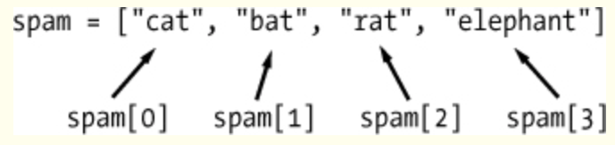

## List

:point_right: list => []
```
[1, 2, 3]
['a', 'b', 'c']
[1, 'a', 'name', 4.5, Ture]

[1, 3, ['a', 'b'], 4]
[1, 3, ['a', ['b', 'c'], 'd'], 4]
[1,2 {'a':3, 'b':4}, 5]
```

:point_right:list index\


:point_right: sublist
```
my_list = ['a', 'b', 'c', 'd']
my_list_a_to_c = my_list[0:3]
my_list_a_to_c_also = my_list[0:-1]

```

:point_right: len of list
```
my_list = [1, 2, 3, 'word']
len(my_list)
```
:point_right:sublist

```
my_list = [1, 2, 3, 'word']
my_list[0:3]
my_list[0:-1]

```
:point_right: changeing value in list
```
my_list = [1, 2, 3, 'word']
print (my_list[0]) #1

my_list[0] = 'abc'
print (my_list[0]) #abc

```
:point_right:concantenation and replication
```
my_list = [1, 2, 3, 'word']
my_second_list = ['abc', 'hello', 'world']

print (my_list + my_second_list)


```
:point_right: in and not in operators
```

my_second_list = ['abc', 'hello', 'world']
'abc' in my_second_list
'def' not in my_second_list
```


:point_right: multiple assignment trick
```

my_list = [1, 2, 3, 'word']
number1 = my_list[0]
number2 = my_list[1]
number3 = my_list[2]

number1, number2, number3 = my_list[0:3]
```

:point_right: adding and remove value

```
my_list = [1, 2, 3, 'word']
my_list.append('hello')

print (my_list)

my_list.remove('hello')
print (my_list)

```
:point_right: sorting value
```

my_list1= [1, 2, 3]
my_list2 = ['d', 'a', 'b', 'word']
my_list3 = [1, 'man', 3, 'word']

print (my_list1.sort())
print (my_list2.sort())
print (my_list3.sort())
```
:point_right: tuple vs list (non-mutable vs mutable)
```
tuple ()
my_tuple = (1, 2, 3)
my_tuple[0] = 'abc'

list []
my_list = [1, 2, 3]
my_list[0] = 'abc'
```

