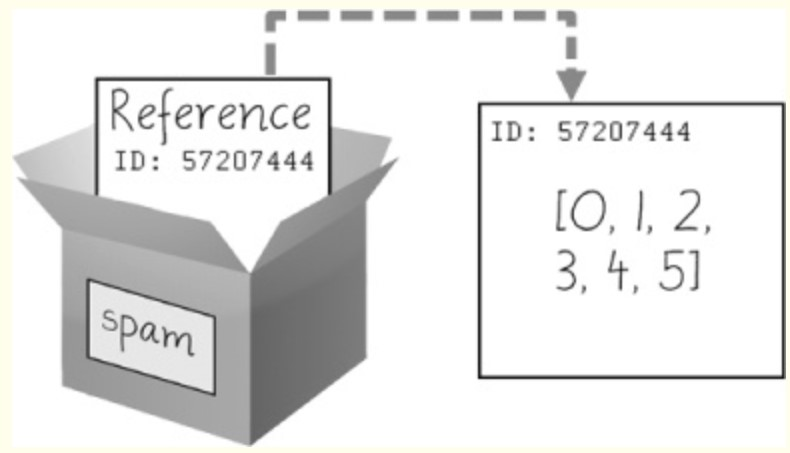
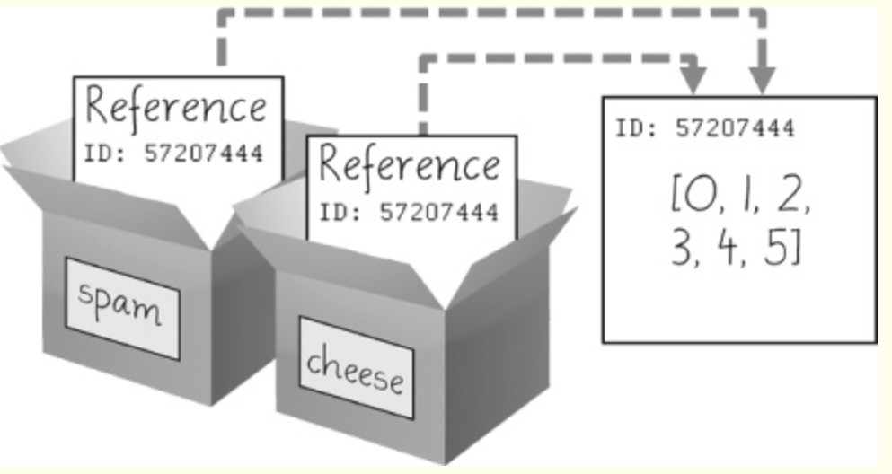

## references

:point_right: variable
```
x = 14
y = x
print (y)

x = 678
print (x)

print (y)
```

:point_right: list
```
dog_list = ['dog1', 'dog2', 'dog3']

dog_list_too = dog_list

dog_list_too[0] = 'cat1'

print (dog_list_too) # ['cat1', 'dog2', 'dog3']

print (dog_list) # guess
```
\

